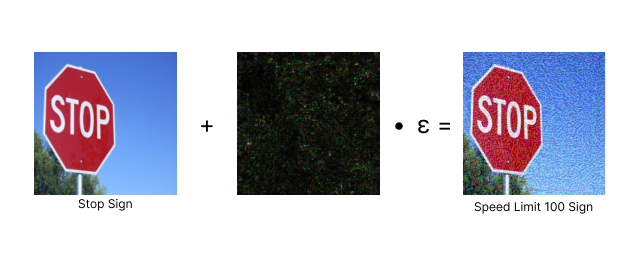

# 🤖🔐 AI Security Challenge: Autonomous Vehicles 🚙

    

This repository contains the code for the 🤖 AI Security Challenge 🔐 run as a collaboration between [ACM Cyber](https://www.acmcyber.com/) & [ACM AI](https://ai.uclaacm.com/). The format of this challenge is similar to an [attack-defense CTF](https://www.quora.com/What-is-an-attack-defense-CTF). Teams compete with one another to develop defenses to their machine learning model while also attacking the models of other teams. The team with the best attacks & defenses wins. The challenge is split into two phases: the development phase and the attack phase. During the development phase, teams are given access to the model and are allowed to train their own models on the dataset. During the attack phase, teams are only given access to another team's model and source code and are tasked with developing attacks against the model. The team with the best attacks & defenses wins.

The Fall 2023 challenge is involves tackling the security of machine learning models in autonomous vehicles. This challenge uses the [German Traffic Sign Recognition Benchmark](https://benchmark.ini.rub.de/gtsrb_dataset.html) dataset. The goal is for teams to develop adversarial attacks & defenses for a fine-tuned [ResNet-18](https://arxiv.org/abs/1512.03385) model trained on the GTSRB dataset. The model is trained to classify traffic signs into 43 different classes similar to how a production ready model would work in an autonomous vehicle.

## 📝 Resources
The following are a set of resources that may be helpful for teams participating in the challenge. These resources are not required to participate in the challenge, but may be helpful for teams that are new to machine learning security.

If you are completely new to adversarial AI, we recommend watching the following recording for an AI security workshop held by **ACM Cyber x ACM AI**.

- **ACM Cyber x ACM AI: AI Security Workshop**: https://youtu.be/nlQ61jntSkQ
- **Adversarial Attacks & Defenses**: https://arxiv.org/pdf/2112.02797.pdf
- **AI Security Challenge Resources Document:** TBD

## Authors
For any questions or concerns about the above challenge, please contact any representative in ACM Cyber or ACM AI.

## Colab links
- [Starter notebook (fgsm)](https://colab.research.google.com/drive/1NcEPDoyoQ8cOxuG2ppFLKCzbvfEnYtXL)